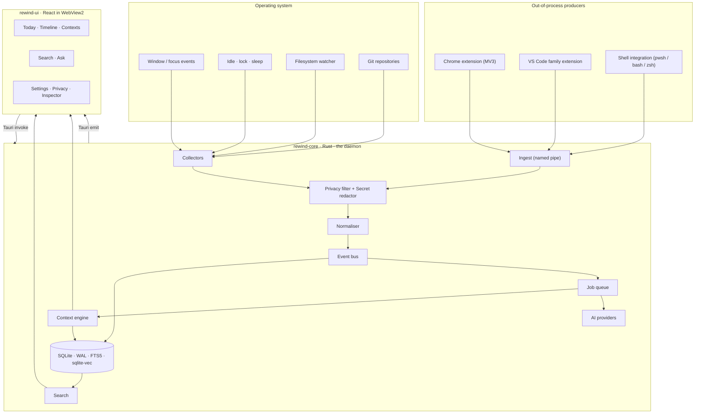
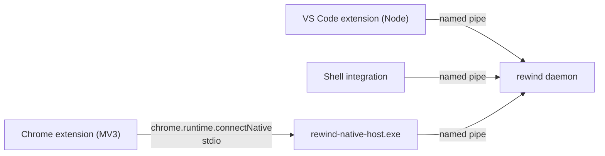
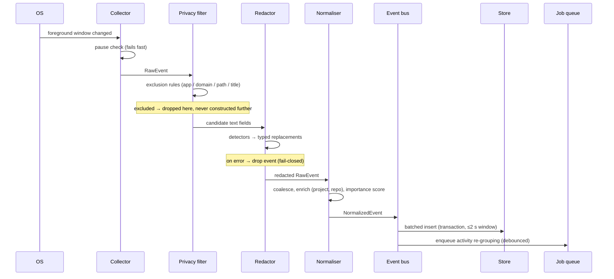
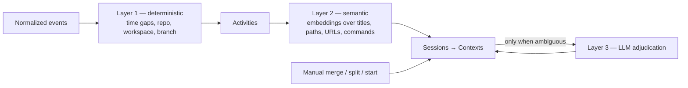

# REWIND — Architecture

> STEP 4 deliverable (§150). Decisions are recorded with their rationale and their cost. Where this
> document deviates from the specification's suggestions, the deviation is called out explicitly (§150:
> no silent product changes).

---

## 1. Shape of the system



The load-bearing rule (§46): **no collector ever writes to the UI, and no collector ever writes to the
database.** Everything crosses the privacy filter and the normaliser first, in that order.

---

## 2. Decision 1 — Tauri v2, confirmed

Per §43. Rust backend, WebView2 frontend on Windows.

**Why it holds up here:** the collectors are native OS work (Win32 hooks, filesystem watchers,
named pipes) that Rust does natively and Electron would need addons for; the process must run all day
at near-zero CPU, where a ~150 MB Chromium runtime is a poor trade; and the security posture in §7 of
PRIVACY.md is easier in a language without an `npm install` supply chain in the daemon.

**What it costs:** two languages, a slower context-engine iteration loop than pure TypeScript, and a
platform (Windows) where Tauri prior art is thinner than on macOS.

**When to revisit:** if WebView2 rendering of the timeline at 10 000+ rows proves unworkable, or if
Tauri v2's tray/global-shortcut plugins are unreliable on Windows 11. Document before changing (§43).

---

## 3. Decision 2 — Where the logic lives (deviation from §45, stated)

§45 suggests `packages/core`, `database`, `context-engine`, `search`, `ai`, `privacy` as TypeScript
packages. **I am putting all of those in Rust instead**, and here is why:

1. **Background execution.** Activity grouping, embeddings, summarisation and compaction must run when
   no window is open. If they live in the webview, closing the window stops the product from thinking.
   Keeping a webview alive purely to run background jobs is a bad trade against §90's CPU budget.
2. **The privacy hot path cannot be in TypeScript.** Redaction must run between the OS callback and
   persistence (PRIVACY §4.2, fail-closed). Collectors are Rust; the redactor must be too. Splitting
   the redactor across two languages is how you end up with two behaviours.
3. **One process, one database handle.** A Node sidecar would mean a second runtime, a second SQLite
   connection, and cross-process transaction coordination — for no gain.

**What stays TypeScript:** the UI, the two extensions, the shared protocol types, the design system,
and the offline evaluation tooling.

**How we keep the spec's intent.** §45's real intent is _clean domain separation_. That is preserved —
the same module names exist, as Rust crates in a Cargo workspace, with the same boundaries. And three
artefacts that must not diverge between languages are stored as **language-neutral data** in
`packages/protocol`:

| Shared artefact            | Format                                          | Consumed by                                                          |
| -------------------------- | ----------------------------------------------- | -------------------------------------------------------------------- |
| Event schema               | JSON Schema → generated Rust structs + TS types | Rust daemon, both extensions, UI                                     |
| Redaction pattern registry | JSON                                            | Rust redactor (hot path), TS redactor (extension-side pre-redaction) |
| Prompt templates (§131)    | Versioned YAML                                  | Rust AI module, TS eval tooling                                      |

A conformance test runs the _same_ fixture corpus through the Rust and TypeScript redactors and fails
if a single output differs. That is the mechanism that makes a two-language redactor safe.

---

## 4. Decision 3 — Transport: named pipes, not localhost HTTP

The obvious design is an HTTP server on `127.0.0.1`. It is also an attack surface: any web page can
reach loopback, and DNS rebinding defeats naive origin checks (INITIAL_ANALYSIS TR-4).

**Chosen design — no TCP port is ever opened.**



- **Windows:** `\\.\pipe\rewind-ingest-<installId>`, ACL'd to the current user SID only.
- **macOS (MVP) / Linux:** Unix domain socket at `$XDG_RUNTIME_DIR/rewind/ingest.sock` (macOS:
  `~/Library/Application Support/REWIND/ingest.sock`), mode `0600`, in a `0700` directory.
- **Authorised local applications** (Cockpit first) use the same socket to emit `ExternalContextEvent`
  — see ADR 0002 D-17. Same pairing, same token, same write-only rule. REWIND never links against a
  third-party application's internals; it defines a protocol and they emit it.
- **Chrome:** a native messaging host binary, registered per-browser, allowlisted to REWIND's extension
  ID only. A web page cannot invoke native messaging; only the allowlisted extension can.

**Properties this buys us:** no listening port, no CORS question, no rebinding, OS-enforced
same-user access control. Every client still presents the per-install token from the keychain, so a
compromised sandbox cannot spoof a producer.

**The API is write-only.** There is no read path over the pipe. Even with the token, a compromised
producer can inject noise but cannot exfiltrate memory.

**Fallback:** if native messaging registration proves unmanageable on some platform, loopback HTTP is
permitted _only_ with token auth + `Origin` allowlist + `Host` validation + 127.0.0.1 bind. Documented
in SECURITY.md; not the default.

---

## 5. Rust workspace

```
apps/desktop/src-tauri/
  crates/
    rewind-daemon/       # process lifecycle, tray, hotkeys, Tauri commands
    rewind-protocol/     # generated types from packages/protocol schemas
    rewind-privacy/      # rule engine + secret redactor  (hot path, fail-closed)
    rewind-collect/      # collectors: system, fs, git, ingest server
      src/os/windows.rs  #   Win32 implementations
      src/os/macos.rs    #   (stub at MVP)
      src/os/mod.rs      #   traits
    rewind-store/        # SQLite, migrations, retention, compaction, job queue
    rewind-context/      # activities, sessions, context inference, scoring
    rewind-search/       # FTS5, vectors, temporal resolution, ranking
    rewind-ai/           # LLM + embedding providers, prompts, sanitisation
    rewind-cli/          # headless: replay fixtures, run evals, inspect DB
```

`rewind-cli` matters more than it looks: it lets the context engine and search be developed and
evaluated against golden fixtures without launching the GUI (INITIAL_ANALYSIS §6).

---

## 6. OS abstraction (portability without a rewrite)

> **macOS and Windows are both shipped targets** ([ADR 0004](adr/0004-windows-is-a-shipped-target.md)
> D-29), with macOS first because it is the machine where the product's value is measurable. Neither
> column below is a port of the other: every provider has an implementation on both, or an explicit
> `unimplemented!` with a ticket. Silence is how a second platform quietly rots.
>
> One asymmetry worth carrying in your head: **Windows needs no permission to read window titles,
> macOS does.** So Windows is the better place to develop the context engine against real data, and
> macOS is the only place to judge whether the product is useful.

| Provider                   | macOS (MVP)                                       | Windows (retained, future)       |
| -------------------------- | ------------------------------------------------- | -------------------------------- |
| `ActiveWindowProvider`     | `NSWorkspace` activation + AX observer for titles | `SetWinEventHook`                |
| `ProcessProvider`          | `NSRunningApplication`, bundle identifier         | `QueryFullProcessImageName`      |
| `IdleProvider`             | `CGEventSourceSecondsSinceLastEventType`          | `GetLastInputInfo`               |
| `LockStateProvider`        | `NSDistributedNotificationCenter`                 | `WTSRegisterSessionNotification` |
| `PowerProvider`            | `NSWorkspace` sleep/wake                          | `WM_POWERBROADCAST`              |
| `ApplicationLauncher`      | `NSWorkspace.open`, URL schemes, CLI              | `ShellExecuteEx`                 |
| `SecureStorageProvider`    | Keychain                                          | Credential Manager               |
| `ShellIntegrationProvider` | zsh `preexec`/`precmd`                            | PowerShell profile               |

**Bundle identifier is the application identity**, not the executable name — the better primitive on
both platforms, and what Level 1 observation keys on.

**macOS blocker B-1:** window titles require the Accessibility (TCC) permission. Without titles, Level
1 observation is worthless — "Figma" carries no context, "Figma — Home Staging V3" carries all of it.
The alternative route, `CGWindowListCopyWindowInfo`, needs Screen Recording permission, which is the
wrong thing to ask for a product that promises no screenshots. So: Accessibility, requested explicitly
in onboarding, and a hard dependency of the whole design.

The original Windows-first table follows, kept for the eventual Windows implementation. ADR 0001 D-1
fixed the boundary: **seven** abstractions, and the domain layer — context
engine, search, privacy, persistence, domain models — contains no platform-conditional code and no
platform types. A `#[cfg(windows)]` outside `rewind-collect::os` or `rewind-daemon::platform` is a
defect, not a shortcut.

| Abstraction        | Purpose                                 | Windows                                    |
| ------------------ | --------------------------------------- | ------------------------------------------ |
| `WindowWatcher`    | Active window and focus changes         | `SetWinEventHook`                          |
| `ProcessInfo`      | Process identity behind a window        | `QueryFullProcessImageName`, cached by PID |
| `IdleWatcher`      | Idle detection                          | `GetLastInputInfo`, 5 s poll               |
| `SessionWatcher`   | Lock / unlock                           | `WTSRegisterSessionNotification`           |
| `ShellIntegration` | Install and remove shell hooks          | PowerShell profile                         |
| `SecureStorage`    | Tokens and provider keys                | Windows Credential Manager                 |
| `Launcher`         | Open a URI, file, workspace or terminal | `ShellExecuteEx`, IDE CLIs                 |

Everything platform-specific sits behind four traits, implemented per OS:

```rust
pub trait WindowWatcher {
    fn subscribe(&self, sink: EventSink) -> Result<Subscription>;
}
pub trait IdleWatcher {
    fn idle_duration(&self) -> Duration;
}
pub trait SessionWatcher {   // lock / unlock
    fn subscribe(&self, sink: EventSink) -> Result<Subscription>;
}
pub trait PowerWatcher {     // sleep / wake / battery
    fn subscribe(&self, sink: EventSink) -> Result<Subscription>;
}
```

| Trait            | Windows (MVP)                                                          | macOS (later)                             |
| ---------------- | ---------------------------------------------------------------------- | ----------------------------------------- |
| `WindowWatcher`  | `SetWinEventHook(EVENT_SYSTEM_FOREGROUND)` + `EVENT_OBJECT_NAMECHANGE` | `NSWorkspace` notifications + AX observer |
| `IdleWatcher`    | `GetLastInputInfo`, polled at 5 s                                      | `CGEventSourceSecondsSinceLastEventType`  |
| `SessionWatcher` | `WTSRegisterSessionNotification`                                       | `NSDistributedNotificationCenter`         |
| `PowerWatcher`   | `WM_POWERBROADCAST`, `GetSystemPowerStatus`                            | `NSWorkspace` sleep/wake                  |

Note on `IdleWatcher`: `GetLastInputInfo` requires polling, which brushes against §91's no-polling
preference. A 5-second timer reading one struct costs microseconds and is the only polling loop in the
product. The alternative — a low-level keyboard hook — is forbidden by §8 and would be a keylogger. This
is documented rather than quietly implemented.

---

## 7. The pipeline, step by step



Two properties worth stating: an excluded event is **never constructed** past the filter (PRIVACY §3.1),
and a batch is at most 2 seconds wide so a crash loses at most 2 seconds (§96).

---

## 8. Event bus (§47)

In-process only — no Kafka, no Redis (§47). A `tokio::sync::broadcast` channel carrying:

| Message               | Emitted when                       | Consumed by                              |
| --------------------- | ---------------------------------- | ---------------------------------------- |
| `RawEventCaptured`    | collector produced an event        | privacy filter                           |
| `EventNormalized`     | normalisation completed            | store writer, job scheduler, debug panel |
| `ActivityUpdated`     | grouping changed an activity       | context engine, UI                       |
| `ContextUpdated`      | inference changed a context        | UI, search indexer                       |
| `SearchIndexed`       | FTS/vector rows written            | debug panel                              |
| `JobStateChanged`     | job queue transition               | UI, debug panel                          |
| `CaptureStateChanged` | pause / resume / collector toggled | tray, UI, all collectors                 |

Slow consumers lag rather than block producers; a lagging consumer logs and resynchronises from the
database. Collection is never blocked by a downstream consumer.

---

## 9. Storage (details in STORAGE.md)

SQLite via `rusqlite` (bundled build), WAL mode, `synchronous = NORMAL`, one writer connection plus a
read pool. FTS5 for lexical search; `sqlite-vec` statically linked for vectors, with an FTS-only
degraded mode if unavailable (TR-7).

One file: `%LOCALAPPDATA%\REWIND\rewind.db`. Backup before every migration (§97).

---

## 10. Job queue (§94, §95)

Persisted in a `jobs` table so work survives restarts.

```
pending → running → completed
                 ↘ failed (retry with exponential backoff, max 5) → dead
```

Job kinds: `group_activities`, `infer_context`, `embed_batch`, `summarise_context`, `daily_summary`,
`compact_range`, `retention_sweep`, `rebuild_index`.

Scheduling rules that protect §90 and §91: jobs run on a bounded low-priority worker pool; heavy jobs
(embeddings, summarisation) require the machine to be idle _or_ on AC power; anything the UI is waiting
on jumps the queue; only one write transaction is in flight at a time.

---

## 11. Context engine (details in CONTEXT_ENGINE.md)

Three layers (§26), executed cheapest-first, and the third almost never runs:



Layer 3 sits behind a trait with a deterministic mock so golden-session tests stay deterministic
(TR-12), and manual corrections always win over all three layers.

---

## 12. Search (details in SEARCH.md)

```
query → intent classification → temporal resolution → FTS5 + vector recall
      → context-graph expansion → scoring → (optional) LLM answer with citations
```

Everything up to the last step is local and deterministic. The LLM step is optional and off by default;
without it, Ask returns ranked, cited results rather than prose.

---

## 13. AI layer (details in AI.md)

```rust
trait EmbeddingProvider { fn embed(&self, texts: &[String]) -> Result<Vec<Vec<f32>>>; fn dims(&self) -> usize; }
trait LlmProvider       { fn complete(&self, req: PromptRequest) -> Result<StructuredResponse>; }
```

Default embeddings: local ONNX (`bge-small-en-v1.5`, 384-dim), model downloaded on first use, never
bundled (TR-6). Default LLM: **none** (PRIVACY §8.1). Optional: Anthropic, OpenAI, any
OpenAI-compatible local server (Ollama, LM Studio).

All prompts are versioned YAML in `packages/protocol/prompts/` (§131). All outputs are schema-validated
before use; a response that fails validation is discarded, never partially parsed (§132).

---

## 14. Frontend

React 19 + TypeScript + Vite, TanStack Query for server state (Tauri commands are the "server"),
Zustand for ephemeral UI state, Tailwind with a small token-based design system, i18n from day one with
English as default (§147). Virtualised lists for the timeline. Full keyboard navigation (§146).

The UI holds no business logic: it renders what Rust computes. This keeps a headless CLI honest and
makes the engine testable without a browser.

---

## 15. Monorepo layout

```
rewind/
  apps/
    desktop/                  # Tauri app: React frontend + src-tauri Rust workspace
    browser-extension/        # Chrome MV3
    vscode-extension/         # VS Code / Cursor / Windsurf
    native-host/              # Chrome native messaging bridge (small Rust binary)
  packages/
    protocol/                 # JSON Schemas, redaction patterns, prompts, generated TS types
    ui/                       # design system components
    shared/                   # TS utilities shared by UI and extensions
    config/                   # tsconfig, eslint, prettier presets
    fixtures/                 # golden sessions, redaction corpus, search eval set
  docs/
```

pnpm workspaces + Turborepo for the TypeScript side; Cargo workspace for Rust; Turbo tasks shell out to
Cargo so `pnpm build` builds everything.

---

## 16. Process and lifecycle

One process. Launches minimised to the tray on login (opt-in, asked during onboarding). The window is a
view onto a daemon that runs whether the window is open or not; closing the window hides it, quitting is
explicit from the tray (§85).

Crash recovery (§96): batched writes ≤2 s, WAL, job queue persisted, and a startup integrity check that
repairs a torn FTS index by rebuilding from `events`.

---

## 17. Observability (§87, §88, §89)

Structured logs (`tracing`) with the categories from §87: `collector`, `storage`, `context-engine`,
`search`, `ai`, `privacy`, `sync`, `ui`. Logs are redacted before writing and rotate at 14 days.

A dev-only debug panel shows live incoming events, normalised events, the current context and its score,
search ranking internals, redactions performed, and collector status. It is compiled out of release
builds by feature flag.

---

## 18. Architectural rules

1. Collectors never touch the database or the UI (§46).
2. Nothing is persisted that has not passed the privacy filter and been redaction-stamped.
3. The event schema is defined once, in `packages/protocol`, and generated into both languages.
4. Any pipeline stage may drop an event; none may block collection.
5. LLM calls happen only in `rewind-ai`, only through a versioned prompt, only with schema-validated
   output, and only after the sanitisation pipeline.
6. Every OS-specific line of code sits behind a trait in `rewind-collect::os`.
7. Everything the UI shows about the past must be traceable to stored evidence (§54).
8. The product name is never hardcoded. Every user-visible occurrence resolves through
   `config.productName`, surfaced to the UI through i18n — window titles, installer strings and
   extension manifests included. REWIND is a codename (ADR 0001 D-2); renaming must be one line
   plus assets.
9. Nothing may foreclose AI coding agents as a context source (ADR 0001 D-8): the `agent.*` event
   types and the `agent_session` link type stay in the model, with no provider-specific assumption.
