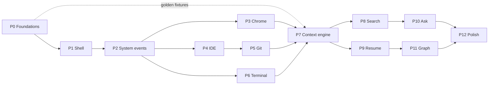

# REWIND — Roadmap

> STEP 8 deliverable (§150). The project as atomic tickets. Every ticket carries Goal, Context,
> Implementation, Files, Dependencies, Acceptance Criteria, Tests and Risks.
>
> Phase order follows §115, with one amendment from INITIAL_ANALYSIS §6: golden fixtures are built in
> Phase 0 so the context engine can be developed against realistic data before the four extension
> integrations exist.

---

## Immediate work order

Superseding the phase sequence for the next stretch (ADR 0001 D-9). The first milestone is **not**
"Tauri starts" — it is **golden session → events → contexts → Resume**, rendered with citations and
with no LLM involved. Only once that chain is convincing on synthetic data do real collectors replace
the synthetic events.

| #   | Work                                                                           | Ticket                 | Status                    |
| --- | ------------------------------------------------------------------------------ | ---------------------- | ------------------------- |
| 1   | Golden sessions + evaluation harness                                           | P0-005, P0-005b        | ✅ done                   |
| 2   | Rust + Tauri prerequisites on **both** machines (MSVC Build Tools / Xcode CLT) | P1-000                 | in progress               |
| 3   | Desktop shell                                                                  | P1-001                 |                           |
| 4   | SQLite + event store                                                           | P1-004                 |                           |
| 5   | **Fake Collector** — replay a golden session through the real pipeline         | P1-007                 |                           |
| 6   | Timeline rendering a golden session                                            | P2-008                 |                           |
| 7   | Context engine V0, deterministic                                               | P7-001, P7-002, P7-004 |                           |
| 8   | Context visualisation                                                          | P7-006                 |                           |
| 9   | Real macOS system collector — Level 1 observation                              | P2-004, P2-005         | needs B-1 (Accessibility) |
| 10  | Browser → Claude Code / Terminal → Cockpit → Git, in D-19 order                | Phases 3–6, reordered  |                           |

**Revised by [ADR 0002](adr/0002-work-context-first-macos.md).** The platform is macOS, the wedge is
work-context rather than developer, and the source priority is D-19: macOS window observation →
browser → Claude Code / Terminal → Cockpit → Git → rich integrations. The IDE collector (Phase 4)
leaves the critical path. Seven blockers are open in ADR 0002; B-1, B-2 and B-3 gate step 2.

The Fake Collector is a permanent component, not scaffolding: it stays in the product for tests,
demos, debugging, regression testing and reproducing user issues. It gets the same review standard as
shipped code.

---

## Phase map

| Phase | Theme          | Exit condition                                                                |
| ----- | -------------- | ----------------------------------------------------------------------------- |
| 0     | Foundations    | Docs, monorepo, schemas, fixtures, CI green                                   |
| 1     | Desktop shell  | Tauri app runs in tray, SQLite migrates, UI shell navigates                   |
| 2     | System events  | Real timeline from real window activity, pause works, privacy filter enforced |
| 3     | Chrome         | URLs in the timeline, exclusions honoured, no open port                       |
| 4     | IDE            | Workspace + file events, project attribution                                  |
| 5     | Git            | Repos, branches, commits as evidence                                          |
| 6     | Terminal       | Commands, exit codes, fail-closed redaction                                   |
| 7     | Context engine | Golden sessions pass; contexts appear and are right                           |
| 8     | Search         | FTS then hybrid; eval targets met                                             |
| 9     | Resume         | The §112 success moment, timed                                                |
| 10    | Ask            | Cited answers, refusal when evidence is thin                                  |
| 11    | Graph          | Decisions, outcomes, "why does this exist?"                                   |
| 12    | Polish         | Onboarding, retention, settings, accessibility                                |

---

# PHASE 0 — FOUNDATIONS

## P0-001 — Documentation set

**Goal.** Produce the product, privacy, architecture, event, context and search documents before code.
**Context.** §116, §150 STEP 1–7. Documentation is the design step, not a write-up of decisions already
made in code.
**Implementation.** Written: INITIAL_ANALYSIS, PRODUCT, PRIVACY, ARCHITECTURE, EVENT_MODEL,
CONTEXT_ENGINE, SEARCH, plus COLLECTORS, STORAGE, SECURITY, AI, UX, PERFORMANCE, TESTING.
**Files.** `docs/*.md`
**Dependencies.** None.
**Acceptance.** All documents exist; every §116 entry is covered; ambiguities recorded in
INITIAL_ANALYSIS §5 rather than silently resolved.
**Tests.** Manual review. Link check in CI.
**Risks.** Documentation drifting from code — mitigated by ADR discipline (P0-008).

---

## P0-002 — Monorepo skeleton

**Goal.** pnpm + Turborepo workspace with the package layout from ARCHITECTURE §15.
**Context.** §45. Structure now, so nothing lands in the wrong layer later.
**Implementation.** Root `package.json`, `pnpm-workspace.yaml`, `turbo.json`, shared tsconfig/eslint/
prettier in `packages/config`, `.gitignore`, `.editorconfig`, `.nvmrc`. Placeholder packages with real
`package.json` and `src/index.ts`.
**Files.** `package.json`, `pnpm-workspace.yaml`, `turbo.json`, `packages/config/**`, `packages/*/package.json`
**Dependencies.** None.
**Acceptance.** `pnpm install` succeeds; `pnpm lint` and `pnpm typecheck` pass on an empty tree;
`pnpm build` runs through Turbo.
**Tests.** CI runs install + lint + typecheck + build on Windows and Ubuntu.
**Risks.** Turbo/Cargo interop — validated in P1-002 when Rust enters the graph.

---

## P0-003 — Protocol package: schemas and codegen

**Goal.** One source of truth for the event schema, generated into Rust and TypeScript.
**Context.** EVENT_MODEL §1; ARCHITECTURE §3 makes divergence between languages the main risk of the
two-language design.
**Implementation.** JSON Schema for `TimelineEvent`, all per-type `metadata` shapes, `Activity`,
`Session`, `Context`, `ContextLink`, `Decision`, `Outcome`, `Project`, `Repository`, `PauseInterval`.
TS types via `json-schema-to-typescript`; Rust structs via `typify` in a `build.rs`. `pnpm codegen`
regenerates both; CI fails if the output is dirty.
**Files.** `packages/protocol/schemas/*.json`, `packages/protocol/src/generated.ts`,
`apps/desktop/src-tauri/crates/rewind-protocol/build.rs`
**Dependencies.** P0-002.
**Acceptance.** A schema change regenerates both languages; hand-editing generated files fails review;
CI detects uncommitted codegen.
**Tests.** Round-trip: a fixture event serialised in Rust deserialises in TS and vice versa, byte-equal.
**Risks.** `typify` gaps on complex unions — fall back to hand-written Rust structs with a conformance
test if needed.

---

## P0-004 — Redaction pattern registry

**Goal.** The secret detectors as language-neutral data with a shared fixture corpus.
**Context.** §80, PRIVACY §4. Two implementations (Rust hot path, TS extension-side) must never diverge.
**Implementation.** `patterns.json`: `{ id, description, regex, confidence, replacement, flags }` for
every class in PRIVACY §4.3. A corpus of positive and negative cases, including the §126 must-catch set
and the TR-10 must-not-catch set (git SHAs, UUIDs, semver).
**Files.** `packages/protocol/redaction/patterns.json`, `packages/fixtures/redaction/{positive,negative}.jsonl`
**Dependencies.** P0-003.
**Acceptance.** Every pattern has ≥3 positive and ≥3 negative fixtures; regexes are RE2-safe (no
backtracking blowups).
**Tests.** Corpus test in both languages; a conformance test asserting identical output across the two
implementations; a ReDoS test with pathological inputs under a 10 ms budget.
**Risks.** Regex dialect differences between Rust `regex` and JS — restricted to the common subset,
enforced by the conformance test.

---

## P0-005 — Golden session fixtures ✅ DONE

**Goal.** Six realistic multi-source event sequences with hand-declared ground truth.
**Context.** §125 and ADR 0001 D-9 — the context engine is the main product risk, so it must be
developable and measurable before any real collector exists.
**Implementation.** The readable source is TypeScript in `packages/fixtures/src/sessions/`: one event
per line with its ground-truth context tag written _on the event_, so events and ground truth cannot
desynchronise. `pnpm build:fixtures` emits `golden/*.json`, the language-neutral artefact Rust reads.
Both forms are committed; `--check` fails CI if the JSON is stale.

| Fixture                        | Events          | Expected              | What it catches                                                              |
| ------------------------------ | --------------- | --------------------- | ---------------------------------------------------------------------------- |
| GS-01 focused debugging        | 40              | 1 context             | Over-splitting on window switches                                            |
| GS-02 temporary interruption   | 27 (+4 noise)   | 1 context             | False split from a 4-minute excursion                                        |
| GS-03 real context switch      | 39              | 2 contexts            | False merge across a sustained switch                                        |
| GS-04 two tasks, same repo     | 36              | 2 contexts            | `repoId` used as a shortcut for context                                      |
| GS-05 failed investigation     | 33              | 1 context, unresolved | Resume for work that was never finished                                      |
| GS-06 chaotic day              | 113 (+16 noise) | 3 contexts            | The benchmark: contexts fragmented across a whole day                        |
| GS-07 cross-app feature work   | 28              | 1 context             | Nine applications, one task, almost no repository signal                     |
| GS-08 two projects interleaved | 32              | 2 contexts            | **The pivot benchmark** — same apps, interleaved, only anchors separate them |
| GS-09 administrative work      | 14              | 1 context             | Zero development events; proves the engine is not code-shaped                |
| GS-10 communication noise      | 21 (+5 noise)   | 1 context             | Interruptions arriving in the apps the work itself uses                      |

**Files.** `packages/fixtures/src/{authoring,build}.ts`, `src/sessions/*.ts`, `golden/*.json`
**Dependencies.** P0-002.
**Acceptance.** ✅ 383 events across 10 sessions, 15 ground-truth contexts; every event either belongs to a context or is
declared noise; fixtures are chronologically ordered; every context declares at least one important
event.
**Tests.** ✅ Integrity suite in `@rewind/eval` — membership, no double assignment, ordering,
important-event subset, chronology.
**Risks.** Fixtures encoding our assumptions rather than reality — revisited against real captured
data at the end of Phase 6. Every future context-engine bug should add or extend a fixture.

---

## P0-005b — Context engine evaluation harness ✅ DONE

**Goal.** Measure context quality before the engine exists, and keep measuring it after.
**Context.** ADR 0001 D-9. A heuristic change must be measurable rather than arguable.
**Implementation.** `@rewind/eval` scores a _prediction_ — a map from event ref to predicted context
id — so it is engine-agnostic: it scores the TypeScript baselines today and the Rust engine later,
via `--predictions out.json`, with no second implementation of the metrics.

Metrics: pairwise grouping (precision / recall / F1), false merge rate, false split rate, context
purity, context coverage, merged and split context counts, important-event recall, noise absorption,
and Adjusted Rand Index. A predicted context counts as merged, and a truth context as split, when its
dominant component holds under 90 % of it — a share threshold rather than a "was another piece
material?" test, because the latter misses total shattering.

Baselines give the benchmark a floor and a ceiling on day one: `oracle` (validates the harness),
`single-context`, `per-event`, `per-repository`, `time-gap-15m`, `repo-and-gap-15m`.

**Files.** `packages/eval/src/{metrics,baselines,cli}.ts`
**Dependencies.** P0-005.
**Acceptance.** ✅ `oracle` scores 1.0 on every metric on every session — the harness validates
itself. ✅ No baseline meets the PRODUCT §10.2 targets, asserted by a test, so the benchmark has real
headroom. ✅ `pnpm eval` prints the comparison table.
**Tests.** ✅ 23 tests: known-answer cases for every metric, plus fixture integrity.
**Risks.** Over-fitting the engine to six fixtures — mitigated by growing the set from real failures.

**Baseline numbers at time of writing** (the bar the real engine must clear):

| predictor        | pairwise F1 | false merge | false split | purity  | coverage | important | ARI   |
| ---------------- | ----------- | ----------- | ----------- | ------- | -------- | --------- | ----- |
| oracle           | 100.0 %     | 0.0 %       | 0.0 %       | 100.0 % | 100.0 %  | 100.0 %   | 1.000 |
| per-repository   | 89.6 %      | 12.7 %      | 5.1 %       | 89.2 %  | 87.1 %   | 84.7 %    | 0.754 |
| repo-and-gap-15m | 84.9 %      | 14.3 %      | 11.7 %      | 89.2 %  | 84.5 %   | 83.1 %    | 0.532 |
| single-context   | 81.2 %      | 27.3 %      | 0.0 %       | 76.4 %  | 76.4 %   | 77.6 %    | 0.500 |
| time-gap-15m     | 78.9 %      | 27.1 %      | 8.9 %       | 76.4 %  | 74.3 %   | 74.9 %    | 0.337 |
| per-event        | 0.0 %       | 0.0 %       | 100.0 %     | 100.0 % | 3.9 %    | 0.0 %     | 0.000 |

Two results worth reading closely. `per-repository` looks strong in aggregate (89.6 %) and collapses
on GS-04 — 66.0 % F1, 50.8 % false merge, ARI 0.000 — which is exactly why that fixture exists.
And `time-gap-15m` produces exactly three contexts on GS-06, the right _number_ and the wrong three
(ARI 0.020), which is why context count is reported but never used as a quality metric on its own.

---

## P0-006 — Search evaluation dataset

**Goal.** A frozen question set with known-correct targets.
**Context.** §127, SEARCH §10. Ranking cannot be tuned by intuition.
**Implementation.** 40+ queries across the seven intents, each mapped to expected targets in the golden
fixtures.
**Files.** `packages/fixtures/search-eval/queries.json`
**Dependencies.** P0-005.
**Acceptance.** Every query resolves to at least one target present in the fixtures.
**Tests.** Consumed by P8-005.
**Risks.** Overfitting ranking to 40 queries — the set grows with every real-use failure.

---

## P0-007 — Database sizing harness

**Goal.** Measure DB growth at 1 day / 1 week / 1 month / 1 year of simulated use.
**Context.** §92. TR-13 estimates ~1.5 MB/day; discovering a 10× error a year from now is unacceptable.
**Implementation.** A `rewind-cli simulate --days N` command generating realistic event volumes,
inserting through the real pipeline, then reporting size by table, index overhead and query latency at
each scale.
**Files.** `apps/desktop/src-tauri/crates/rewind-cli/src/simulate.rs`
**Dependencies.** P1-004.
**Acceptance.** Reports total size, per-table breakdown, FTS and vector overhead, and p95 timeline query
latency at 1 y scale.
**Tests.** Runs in CI weekly at the 1-month scale; asserts < 60 MB/month and < 100 ms timeline queries.
**Risks.** Simulated distributions being unrealistic — recalibrated from real data after Phase 6.

---

## P0-008 — CI, ADRs and quality gates

**Goal.** The automation that keeps the rules in these documents true.
**Context.** §87, §123, PRIVACY §2.
**Implementation.** GitHub Actions: install, lint, typecheck, `cargo clippy -D warnings`, `cargo test`,
`vitest`, codegen-dirty check, link check. Plus the **no-keylogger check**: CI greps the Rust tree for
`SetWindowsHookEx`, `WH_KEYBOARD`, `CGEventTap`, `IOHIDManager` and fails the build if any appear.
ADR template in `docs/adr/`.
**Files.** `.github/workflows/ci.yml`, `scripts/check-forbidden-apis.mjs`, `docs/adr/0000-template.md`
**Dependencies.** P0-002.
**Acceptance.** CI green on an empty tree; the forbidden-API check fails on a deliberately planted call.
**Tests.** A test commit adding a keyboard hook must fail CI.
**Risks.** None significant.

---

# PHASE 1 — DESKTOP SHELL

## P1-000 — Toolchain prerequisites

**Goal.** Rust MSVC toolchain and VS C++ Build Tools installed.
**Context.** TR-1. Verified absent on this machine; blocks every Rust ticket.
**Implementation.** `rustup` with `stable-x86_64-pc-windows-msvc`; VS Build Tools with the C++ desktop
workload; confirm WebView2 (present on Win11). Document in `CONTRIBUTING.md`.
**Files.** `CONTRIBUTING.md`
**Dependencies.** None.
**Acceptance.** `cargo --version` and `cargo build` on a hello-world Tauri app both succeed.
**Tests.** Manual.
**Risks.** VS Build Tools is a multi-GB install — flagged so it is not a surprise.

---

## P1-001 — Tauri v2 application shell

**Goal.** A window that opens, built by Turbo.
**Context.** §43, ARCHITECTURE §2.
**Implementation.** `apps/desktop` with Vite + React 19 + TS frontend and `src-tauri` Cargo workspace.
Turbo task shells out to Cargo. Dev and release configs; single-instance guard.
**Files.** `apps/desktop/**`, `apps/desktop/src-tauri/tauri.conf.json`
**Dependencies.** P1-000, P0-002.
**Acceptance.** `pnpm dev` opens the window with HMR; `pnpm build` produces an installer; launching
twice focuses the existing instance.
**Tests.** Smoke test in CI (build only).
**Risks.** Turbo↔Cargo caching interplay — Cargo output excluded from Turbo's cache keys.

---

## P1-002 — Tray, lifecycle and global hotkey

**Goal.** The app lives in the tray and is reachable from anywhere.
**Context.** §85, §86, §84.
**Implementation.** Tray icon with recording state (`● Recording` / `⏸ Paused`); menu: Open, Pause ▸
(5 m / 30 m / 1 h / until resumed), Resume, Remember current context, Quit. Global shortcut
`Ctrl+Shift+Space`, configurable, with a conflict check. Closing the window hides it; quit is explicit.
**Files.** `crates/rewind-daemon/src/tray.rs`, `src/hotkey.rs`
**Dependencies.** P1-001.
**Acceptance.** Tray state matches capture state within 100 ms; hotkey opens the command palette from
any foreground app; quitting stops all collectors.
**Tests.** Manual matrix; automated state-machine test on the capture-state reducer.
**Risks.** Global shortcut conflicts — detected at registration, surfaced in Settings.

---

## P1-003 — Configuration

**Goal.** Typed, validated, hot-reloadable configuration.
**Context.** §148, §149.
**Implementation.** `config.json` in `%APPDATA%\REWIND` with a JSON Schema, defaults, migration on
version bump, and a `ConfigStore` emitting change events on the bus. Feature flags (`screenshots`,
`graphView`, `localLLM`, `layer3Adjudication`), all off by default.
**Files.** `crates/rewind-daemon/src/config.rs`, `packages/protocol/schemas/config.json`
**Dependencies.** P0-003, P1-001.
**Acceptance.** Invalid config falls back to defaults with a visible warning rather than crashing;
changes propagate without restart.
**Tests.** Unit tests for defaults, migration and invalid input.
**Risks.** None significant.

---

## P1-004 — SQLite store and migrations

**Goal.** The database, versioned, backed up before migration.
**Context.** §36, §97, STORAGE.md.
**Implementation.** `rusqlite` bundled, WAL, `synchronous=NORMAL`, one writer + read pool. Numbered
migrations in `migrations/NNNN_*.sql` applied in a transaction with a `schema_version` table. Automatic
backup before any migration that drops or rewrites. Initial schema: `events`, `activities`, `sessions`,
`contexts`, `context_links`, `projects`, `repositories`, `pause_intervals`, `jobs`, `privacy_rules`,
`context_rules`, plus FTS5 tables.
**Files.** `crates/rewind-store/src/**`, `crates/rewind-store/migrations/**`
**Dependencies.** P1-001, P0-003.
**Acceptance.** Fresh install creates the schema; re-running migrations is a no-op; a backup file
appears before a destructive migration; a corrupted DB is detected at startup with a recovery path.
**Tests.** Migration up-tests from every prior version; crash-during-migration leaves a usable backup.
**Risks.** WAL files on OneDrive-synced folders — `%LOCALAPPDATA%` avoids this by design.

---

## P1-005 — Logging and observability

**Goal.** Structured, redacted, rotating logs in the §87 categories.
**Context.** §87, §89.
**Implementation.** `tracing` with JSON output, category spans, 14-day rotation, and a redaction layer
on the writer so no log line can contain a secret. In-memory ring buffer for the debug panel.
**Files.** `crates/rewind-daemon/src/telemetry.rs`
**Dependencies.** P1-001, P2-002 (redactor).
**Acceptance.** Every module logs under a §87 category; a planted secret in a log call is redacted.
**Tests.** Unit test asserting redaction of a log payload.
**Risks.** Log volume — sampled at debug level, off in release.

---

## P1-006 — UI shell, routing and design tokens

**Goal.** Navigation and the visual language.
**Context.** §48, §142, §143, §146, §147, UX.md.
**Implementation.** Routes: Today, Timeline, Contexts, Search, Ask, Settings. Tailwind with a token
layer (light/dark, calm, dense but legible; no gradients, no giant central chatbot). i18n scaffolding
with English default. Keyboard navigation and focus states from the start.
**Files.** `apps/desktop/src/**`, `packages/ui/**`
**Dependencies.** P1-001.
**Acceptance.** All six routes render with empty states (§144); dark and light both pass WCAG AA
contrast; full keyboard traversal; no hardcoded user-facing strings.
**Tests.** Component tests; axe accessibility check in CI.
**Risks.** Design drift — token file is the single source of truth.

---

## P1-007 — Fake Collector (permanent)

**Goal.** Replay a golden session through the real pipeline as if it were live capture.
**Context.** ADR 0001 D-9. This is what lets the context engine, the timeline and Resume be built and
demonstrated before a single OS hook exists — and it stays in the product afterwards.
**Implementation.** A collector implementing the same `Collector` trait as the real ones, sourcing
events from `packages/fixtures/golden/*.json`. Two modes: `instant` (ingest the whole session at once,
for tests) and `realtime` (replay at 1×, or accelerated, for demos and manual UX work). Events pass
through the identical path — pause check, privacy rules, redaction, normalisation, persistence — so
nothing about the pipeline is bypassed. Reachable from the dev debug panel and from `rewind-cli`.
**Files.** `crates/rewind-collect/src/collectors/fake.rs`, `crates/rewind-cli/src/replay.rs`
**Dependencies.** P1-004, P2-006, P0-005.
**Acceptance.** A golden session replays into an empty database and produces exactly its declared
event count; replaying twice is idempotent (event ids are deterministic); the fake collector is
disabled in release builds unless a developer flag is set.
**Tests.** Replay each of the six fixtures; assert stored event counts and that no fixture event is
dropped by the privacy filter unexpectedly.
**Risks.** Divergence between fixture events and what real collectors emit — mitigated by
re-validating the fixtures against real captured data at the end of Phase 6 (P0-005 risk note).

---

# PHASE 2 — SYSTEM EVENTS

## P2-001 — OS abstraction traits

**Goal.** Every platform-specific call behind a trait.
**Context.** ARCHITECTURE §6; portability without a later rewrite (TR-2).
**Implementation.** `WindowWatcher`, `IdleWatcher`, `SessionWatcher`, `PowerWatcher` with a Windows
implementation and a `mock` implementation for tests. macOS module stubbed with `unimplemented!`.
**Files.** `crates/rewind-collect/src/os/{mod,windows,mock}.rs`
**Dependencies.** P1-001.
**Acceptance.** No `#[cfg(windows)]` outside `os/windows.rs`; the mock drives the full pipeline in tests.
**Tests.** Pipeline integration test running entirely on mocks.
**Risks.** Trait shape wrong for macOS — reviewed against the macOS API surface before freezing.

---

## P2-002 — Privacy rule engine and secret redactor (Rust)

**Goal.** The privacy boundary, fail-closed.
**Context.** §80, §81, PRIVACY §3–4, TR-9. **This ships before any collector writes to the database.**
**Implementation.** Rule matching (application, domain, path, title, eventType; `ignore` beats `redact`;
user beats default; most-specific wins). Redactor compiled from `patterns.json` with the conservative
entropy stage from PRIVACY §4.4. `redact()` cannot panic; on error the caller drops the event.
Persistence rejects events without a `RedactionStamp`.
**Files.** `crates/rewind-privacy/src/{rules,redact,entropy}.rs`
**Dependencies.** P0-004, P1-004.
**Acceptance.** The §126 corpus never reaches persistence; git SHAs and UUIDs survive intact; an event
without a stamp is rejected by the store with an error, not a warning.
**Tests.** Full fixture corpus; conformance against the TS implementation; a fault-injection test where
the redactor errors and the event must be **absent** from the DB; ReDoS budget test.
**Risks.** A missing detector class — mitigated by the registry being data and easy to extend.

---

## P2-003 — Pause enforcement

**Goal.** During a pause, nothing is captured — provably.
**Context.** §7, PRIVACY §5, PVR-2.
**Implementation.** `CaptureState` machine; `pause_intervals` persisted; enforcement at collector,
ingest and store; `CaptureStateChanged` broadcast; tray and UI reflect state; auto-resume at expiry with
a notification.
**Files.** `crates/rewind-daemon/src/capture_state.rs`, `crates/rewind-store/src/pause.rs`
**Dependencies.** P1-004, P2-002.
**Acceptance.** No event with a timestamp inside a pause interval exists in the DB, including events
submitted late by a producer that was asleep during the pause.
**Tests.** Integration test injecting an event backdated into a pause window; must be rejected. State
machine unit tests for all four durations and restart-during-pause.
**Risks.** Clock changes during a pause — pause intervals stored in UTC.

---

## P2-004 — Window and focus collector

**Goal.** The base timeline.
**Context.** §11, EVENT_MODEL §3.1.
**Implementation.** `SetWinEventHook` for `EVENT_SYSTEM_FOREGROUND` and `EVENT_OBJECT_NAMECHANGE` on a
dedicated message-pump thread. Resolve process name and executable path. Apply privacy rules
synchronously inside the callback. Coalesce per EVENT_MODEL §5.
**Files.** `crates/rewind-collect/src/os/windows.rs`, `src/collectors/window.rs`
**Dependencies.** P2-001, P2-002, P2-003.
**Acceptance.** Focus changes appear within 200 ms; excluded apps produce no event at all; titles are
redacted and `sensitive` by default; a one-hour session stays under 1 % CPU.
**Tests.** Mock-driven coalescing tests; a manual soak test with CPU measurement.
**Risks.** Hook thread starvation under load — dedicated thread, non-blocking sink.

---

## P2-005 — Idle, lock and power collectors

**Goal.** Session boundaries.
**Context.** §11, §69, §70.
**Implementation.** `GetLastInputInfo` polled at 5 s (documented exception to §91, ARCHITECTURE §6);
`WTSRegisterSessionNotification` for lock/unlock; `WM_POWERBROADCAST` for sleep/wake and AC/battery.
**Files.** `crates/rewind-collect/src/collectors/{idle,session,power}.rs`
**Dependencies.** P2-001.
**Acceptance.** Idle start/end fire at the configured threshold; lock and sleep produce hard boundaries;
battery state is available to the job scheduler.
**Tests.** Mock-driven; manual verification of lock and sleep.
**Risks.** The idle poll being the only polling loop — measured; must be under 0.1 % CPU.

---

## P2-006 — Normaliser and event bus

**Goal.** The nine-step pipeline from EVENT_MODEL §4.
**Context.** §10, §46, §47, §67, §68.
**Implementation.** Pause check → rules → redaction → canonicalisation → coalescing → enrichment →
importance → `searchableText` → validation. `tokio::sync::broadcast` bus with the ARCHITECTURE §8
message set; lagging consumers resynchronise instead of blocking producers.
**Files.** `crates/rewind-collect/src/normalize.rs`, `crates/rewind-daemon/src/bus.rs`
**Dependencies.** P2-002, P0-003.
**Acceptance.** Each step is independently unit-testable; a malformed event is dropped and logged, never
stored; coalescing hits the ~3:1 ratio from TR-13 on the golden fixtures.
**Tests.** Per-step unit tests; end-to-end fixture replay asserting output events exactly.
**Risks.** Coalescing hiding real signal — ratio and dropped-event counts exposed in the debug panel.

---

## P2-007 — Store writer with batching and crash safety

**Goal.** Durable writes that lose at most two seconds.
**Context.** §96.
**Implementation.** Batched inserts in a single transaction, flushed on 2 s or 100 events; FTS rows in
the same transaction; startup integrity check rebuilding a torn FTS index from `events`.
**Files.** `crates/rewind-store/src/writer.rs`
**Dependencies.** P1-004, P2-006.
**Acceptance.** Kill -9 during writes loses ≤2 s and leaves a consistent DB; FTS stays in sync.
**Tests.** Crash-injection test in a loop; FTS consistency check.
**Risks.** Write amplification from FTS — measured by P0-007.

---

## P2-008 — Timeline UI

**Goal.** A readable vertical timeline of real activity.
**Context.** §50, §108.
**Implementation.** Virtualised list grouped by time and source, with filters (all / browser / code /
terminal / git), day navigation, and live updates from `EventNormalized`.
**Files.** `apps/desktop/src/routes/timeline/**`
**Dependencies.** P2-007, P1-006.
**Acceptance.** 10 000 events scroll at 60 fps; filters apply in under 100 ms; live events appear
without a refresh.
**Tests.** Component tests; performance test at 100 k rows.
**Risks.** WebView2 virtualisation performance — measured early; this is the §2 revisit trigger.

---

## P2-009 — Developer debug panel

**Goal.** See the pipeline while building it.
**Context.** §88.
**Implementation.** Dev-only route: incoming raw events, normalised output, redactions applied by
detector, coalescing ratio, collector status, bus lag, job queue state. Compiled out of release builds.
**Files.** `apps/desktop/src/routes/debug/**`
**Dependencies.** P2-006.
**Acceptance.** Present in dev, absent from a release binary (verified by string search).
**Tests.** Build-mode assertion in CI.
**Risks.** Leaking unredacted data into a dev surface — the panel shows post-redaction data only.

**Phase 2 exit:** the app records a real day of window activity, the timeline is readable, exclusions and
pause demonstrably work, and idle CPU is measured.

---

# PHASE 3 — CHROME

## P3-001 — Ingest transport: named pipe + native host

**Goal.** Out-of-process producers deliver events with no TCP port open.
**Context.** ARCHITECTURE §4, TR-4, SECURITY.md.
**Implementation.** Named pipe server (`\\.\pipe\rewind-ingest-<installId>`) ACL'd to the current user;
length-prefixed JSON frames; token from the OS keychain on every frame; idempotent by event `id`. Chrome
native messaging host binary relaying stdio↔pipe, allowlisted to REWIND's extension ID.
**Files.** `crates/rewind-collect/src/ingest/**`, `apps/native-host/**`
**Dependencies.** P2-006, P2-003.
**Acceptance.** No listening TCP socket exists (verified with `netstat`); a frame without a valid token
is rejected; duplicate ids are ignored; events during a pause are rejected.
**Tests.** Integration test over a real pipe; replay/duplicate test; token-rejection test.
**Risks.** Native messaging registration on Windows (registry keys per browser) — handled by the
installer, with a manual fallback documented.

---

## P3-002 — Pairing flow and token management

**Goal.** Extensions get the token without the user copying secrets around.
**Context.** SECURITY.md.
**Implementation.** Token generated at install, stored in Windows Credential Manager. Extension requests
pairing; the desktop app shows an in-app confirmation naming the requesting extension; on approval the
token is delivered over the native host channel. Revocable in Settings.
**Files.** `crates/rewind-daemon/src/pairing.rs`, extension `background/pairing.ts`
**Dependencies.** P3-001.
**Acceptance.** An unpaired extension cannot submit events; revoking immediately stops ingest.
**Tests.** Pairing, revocation and re-pairing integration tests.
**Risks.** Confusing UX — one screen, one button, plain language.

---

## P3-003 — Chrome MV3 extension

**Goal.** Tab and navigation events with domain exclusions honoured in the extension.
**Context.** §12, §82, EVENT_MODEL §3.2.
**Implementation.** Minimal permissions (`tabs`, `nativeMessaging`; **no** `host_permissions`, **no**
incognito access). Listeners for `onActivated`, `onUpdated`, `onRemoved`, `webNavigation.onCommitted`.
Buffer in `chrome.storage.session`, flush on a `chrome.alarms` heartbeat and on every event (TR-11).
Apply domain exclusions and URL policy **in the extension** so excluded URLs never leave the browser.
**Files.** `apps/browser-extension/**`
**Dependencies.** P3-002, P0-004 (TS redactor).
**Acceptance.** Excluded domains produce no event; query strings stripped except on the allowlist;
service-worker eviction loses no events; extension idle CPU is negligible.
**Tests.** Extension unit tests for the URL policy; a manual eviction test; the shared redaction
conformance suite.
**Risks.** Chrome Web Store review of a native-messaging extension — a privacy-policy page and a clear
justification are prepared in Phase 12.

---

## P3-004 — Browser events in the timeline

**Goal.** URLs visible, grouped, with dwell time.
**Context.** §50.
**Implementation.** Timeline rendering for browser events with favicon, host, title, dwell; dwell
computed from activation to deactivation.
**Files.** `apps/desktop/src/routes/timeline/**`
**Dependencies.** P3-003, P2-008.
**Acceptance.** A browsing session renders as a readable research trail rather than a wall of rows.
**Tests.** Component tests with fixture data.
**Risks.** Noise from background tabs — handled by the EVENT_MODEL §5 coalescing rules.

---

# PHASE 4 — IDE

## P4-001 — VS Code family extension

**Goal.** Workspace and file signal from VS Code, Cursor and Windsurf.
**Context.** §13, EVENT_MODEL §3.3.
**Implementation.** One extension targeting the VS Code API surface all three share. Events:
workspace opened/closed, file opened/saved/closed, language ID, diagnostics summary. Transport over the
named pipe (Node has direct access). **Never file contents.** Respect path exclusions locally.
**Files.** `apps/vscode-extension/**`
**Dependencies.** P3-001, P3-002.
**Acceptance.** Installs in all three editors; no file content ever transmitted (asserted by a payload
test); excluded paths produce nothing.
**Tests.** Extension integration tests; a payload assertion that no field exceeds a path-sized length.
**Risks.** API divergence in forks — restricted to stable, long-standing APIs.

---

## P4-002 — Filesystem collector

**Goal.** Catch edits made outside the IDE.
**Context.** §14.
**Implementation.** `notify` watchers on authorised workspaces only; ignore-globs from PRIVACY §3.2;
3 s debounce per directory; `fs.batch` above 5 changes.
**Files.** `crates/rewind-collect/src/collectors/fs.rs`
**Dependencies.** P2-006.
**Acceptance.** A `pnpm install` produces at most a handful of batch events, not thousands; no event
from `node_modules` or build output.
**Tests.** Storm test writing 10 000 files; asserts bounded event count and CPU.
**Risks.** Watcher exhaustion on large trees — bounded watch count with a visible warning.

---

## P4-003 — Project and repository model

**Goal.** Attribute every event to a project.
**Context.** §65, §66, EVENT_MODEL §11.
**Implementation.** Detect projects by Git root, then IDE workspace root, then longest common ancestor
of recent edits. Longest-prefix path matching for enrichment, cached. Per-project exclusion toggle.
**Files.** `crates/rewind-collect/src/enrich/project.rs`
**Dependencies.** P4-001, P5-001.
**Acceptance.** Events carry the right `projectId`; nested repos resolve to the innermost; excluding a
project stops capture for it.
**Tests.** Unit tests over a synthetic directory tree including nested and sibling repos.
**Risks.** Monorepo ambiguity — innermost Git root wins, overridable by the user.

---

# PHASE 5 — GIT

## P5-001 — Git repository discovery and state

**Goal.** Know the repos, branches and HEADs in play.
**Context.** §15, §66.
**Implementation.** `gitoxide` (`gix`) — no shelling out. Discover repos from IDE workspaces and watched
paths; read remote, default branch, current branch, HEAD; watch `.git/HEAD` and `.git/refs` for changes
rather than polling.
**Files.** `crates/rewind-collect/src/collectors/git.rs`
**Dependencies.** P4-002.
**Acceptance.** Branch changes detected within 2 s; no polling loop; large repos do not stall startup.
**Tests.** Fixture repos with branches, detached HEAD, submodules, worktrees.
**Risks.** `gix` API churn — pinned version.

---

## P5-002 — Commit, checkout, merge events

**Goal.** Commits as permanent evidence.
**Context.** §15, EVENT_MODEL §3.5.
**Implementation.** On ref change, read new commits: SHA, redacted message, changed paths, insertion/
deletion counts, authorship match. Emit checkout, merge, rebase, stash. **Never diff contents.**
**Files.** `crates/rewind-collect/src/collectors/git.rs`
**Dependencies.** P5-001.
**Acceptance.** A commit appears within 2 s with correct file list; SHAs survive redaction (TR-10);
rebasing 20 commits does not produce 20 spurious "new work" events.
**Tests.** Fixture repos exercising commit, amend, rebase, merge, cherry-pick.
**Risks.** Rebase noise — deduplicated by tree hash.

---

## P5-003 — Ticket ID extraction

**Goal.** The single strongest context signal.
**Context.** CONTEXT_ENGINE §4.2 (weight 0.28).
**Implementation.** Extract ticket IDs from branch names, commit messages, and issue-tracker URLs;
configurable patterns (`[A-Z]{2,10}-\d+`, `#\d+`); normalise to a canonical key.
**Files.** `crates/rewind-collect/src/enrich/ticket.rs`
**Dependencies.** P5-002, P3-003.
**Acceptance.** `ACM-3921` in a branch, a commit and a Linear URL all normalise to one key.
**Tests.** Unit tests across formats and false positives (e.g. `UTF-8`, `HTTP-2`).
**Risks.** False positives merging unrelated contexts — a denylist plus a minimum-digit rule.

---

# PHASE 6 — TERMINAL

## P6-001 — Shell integration

**Goal.** Commands captured by explicit opt-in, never by a shell spy.
**Context.** §16 — "ne jamais créer un shell espion généralisé".
**Implementation.** Installable hooks the user opts into: PowerShell `PSConsoleHostReadLine` +
`Prompt` wrapper; bash `PROMPT_COMMAND` + `DEBUG` trap; zsh `preexec`/`precmd`. Each emits command, cwd,
exit code and duration over the pipe. An installer command writes the profile snippet, shows the diff
first, and can uninstall.
**Files.** `apps/shell-integration/**`, `crates/rewind-cli/src/shell_install.rs`
**Dependencies.** P3-001.
**Acceptance.** Opt-in only; the profile change is shown before it is written; uninstall is clean;
shell startup overhead under 5 ms.
**Tests.** Integration tests per shell; startup-time benchmark.
**Risks.** Breaking a user's prompt — snippet is defensive, wrapped in existence checks, and never
overwrites an existing `PROMPT_COMMAND`.

---

## P6-002 — Command events with mandatory redaction

**Goal.** The highest-value and highest-risk source, handled safely.
**Context.** §16, §17, PRIVACY §4.2.
**Implementation.** `terminal.command` with redacted command line, cwd, exit code, duration. On non-zero
exit and only if enabled, the last N stderr lines, redacted. Full stdout is never captured.
**Files.** `crates/rewind-collect/src/collectors/terminal.rs`
**Dependencies.** P6-001, P2-002.
**Acceptance.** `export STRIPE_KEY=sk_live_…` stores `export STRIPE_KEY=[REDACTED:stripe_secret_key]`;
`curl -H "Authorization: Bearer …"` is redacted; a redactor failure drops the event entirely.
**Tests.** The §126 corpus as literal command lines; fault injection.
**Risks.** A novel secret format slipping through — registry is extensible; users can add patterns.

---

## P6-003 — Terminal restore

**Goal.** Reopen a terminal in the right directory.
**Context.** §62 — no attempt to restore a full shell session at MVP.
**Implementation.** Open the user's default terminal at the recorded `cwd`, display the last command as
copyable text. Never auto-execute.
**Files.** `crates/rewind-daemon/src/restore/terminal.rs`
**Dependencies.** P6-002.
**Acceptance.** Terminal opens at the right cwd; the last command is shown but not run.
**Tests.** Manual across Windows Terminal, pwsh, Git Bash.
**Risks.** Executing something destructive — mitigated absolutely: REWIND never runs a captured command.

---

# PHASE 7 — CONTEXT ENGINE

## P7-001 — Activity grouping · **P7-002** — Sessionisation

**Goal.** Stages A and B of CONTEXT_ENGINE §2–3.
**Context.** §22, §23, §69, §70.
**Implementation.** The grouping loop with `GAP_MAX`, hard boundaries, coherence predicate, and
deterministic labels; session boundaries on idle, lock, sleep, day cutoff and sustained project switch;
idle excluded from all durations.
**Files.** `crates/rewind-context/src/{activity,session}.rs`
**Dependencies.** P2-007.
**Acceptance.** Golden fixtures produce the expected activity and session counts; no duration anywhere
includes idle time.
**Tests.** Fixture replay via `rewind-cli`; property test that durations never exceed wall time.
**Risks.** Threshold tuning — config-driven, validated against the whole golden set.

---

## P7-003 — Local embedding provider

**Goal.** Semantic similarity without the cloud.
**Context.** §33, §130, TR-6.
**Implementation.** `EmbeddingProvider` trait; ONNX `bge-small-en-v1.5` (384-dim) downloaded on first
use; batched inference in the job queue at low priority; suspended on battery below threshold.
Structured embed-text format from CONTEXT_ENGINE §4.4.
**Files.** `crates/rewind-ai/src/embedding/**`
**Dependencies.** P1-004, P7-001.
**Acceptance.** Activities embed within 60 s of closing; average CPU contribution under 1 %; the engine
still works with embeddings disabled (weights renormalise).
**Tests.** Determinism check; latency benchmark; a disabled-provider path test.
**Risks.** Model download failure — cached, retried, and non-fatal.

---

## P7-004 — Context assignment

**Goal.** Stage C — the heart of the product.
**Context.** CONTEXT_ENGINE §4.
**Implementation.** Candidate selection, the six-feature scorer, recency factor, assign/new/ambiguous
decision rule, confidence computation, deterministic naming ladder.
**Files.** `crates/rewind-context/src/assign.rs`, `src/score.rs`, `src/name.rs`
**Dependencies.** P7-001, P7-003, P5-003.
**Acceptance.** All six golden fixtures produce the expected context counts and mappings; ambiguous-band
rate under 15 % on fixtures.
**Tests.** Golden replay; per-feature unit tests; a weight-sensitivity report.
**Risks.** This is the ticket most likely to need several iterations — budgeted accordingly.

---

## P7-005 — Manual control and feedback rules

**Goal.** Loop D: correction must be one gesture and must teach.
**Context.** §29, §30, §31, §32.
**Implementation.** Start / merge / split / rename / move-activity, each recording `context_rules`
affinity or repulsion entries applied as bounded score adjustments. Settings lists learned rules with a
"forget" action. Manual assignments are immutable by the engine.
**Files.** `crates/rewind-context/src/manual.rs`, `src/rules.rs`, `apps/desktop/src/routes/contexts/**`
**Dependencies.** P7-004.
**Acceptance.** Merge and split take one action and are undoable; a repulsion rule prevents the same
false merge recurring on replay.
**Tests.** Replay a fixture, apply a correction, replay again and assert the outcome changed.
**Risks.** Rules over-fitting and freezing bad behaviour — bounded at ±0.20 and inspectable.

---

## P7-006 — Split/merge proposals and context UI

**Goal.** Contexts become a usable surface.
**Context.** §27, §51, §52.
**Implementation.** Nightly proposal job with the four-condition split test; Contexts list with cards
(§51) and detail view (§52): summary, timeline, files, URLs, commands, commits, decisions, next steps.
**Files.** `crates/rewind-context/src/propose.rs`, `apps/desktop/src/routes/contexts/**`
**Dependencies.** P7-005.
**Acceptance.** Proposals are never auto-applied; the detail view renders every section from stored
evidence only.
**Tests.** Proposal precision measured against fixtures.
**Risks.** Proposal spam — capped at three visible proposals at a time.

**Phase 7 exit:** contexts are correct enough on real data that the false-merge and false-split targets
in PRODUCT §10.2 are met.

---

# PHASE 8 — SEARCH

## P8-001 — FTS5 index and lexical search

**Goal.** Fast, useful keyword search.
**Context.** §37, SEARCH §4.1.
**Implementation.** Three FTS5 external-content tables; the identifier-splitting tokenisation pass;
bm25 column weights; prefix indexes for search-as-you-type; incremental indexing in the write path.
**Files.** `crates/rewind-search/src/fts.rs`
**Dependencies.** P2-007.
**Acceptance.** `stripe.webhook.ts` matches a `webhook` query; search-as-you-type under 50 ms at 1 y
scale.
**Tests.** Tokenisation unit tests; latency benchmark from P0-007 data.
**Risks.** Index size — measured; roughly 1.5× the text.

---

## P8-002 — Temporal resolution

**Goal.** Understand time expressions correctly.
**Context.** §59, SEARCH §3.
**Implementation.** The full grammar, resolved with `tzOffsetMinutes` and the 04:00 work-day cutoff;
lunch inferred from the user's own idle history; hard vs. soft filters; the editable resolved-window
chip in the UI.
**Files.** `crates/rewind-search/src/temporal.rs`
**Dependencies.** P1-004.
**Acceptance.** Every expression class in SEARCH §3 resolves correctly across DST and a timezone change.
**Tests.** Frozen-clock table tests, including a user who flies between the work and the question.
**Risks.** Locale-specific phrasing — English only at MVP, structure ready for i18n.

---

## P8-003 — Vector index · **P8-004** — Hybrid ranking

**Goal.** Semantic recall and the combined ranking.
**Context.** §38, §58, SEARCH §4–6.
**Implementation.** `sqlite-vec` statically linked with graceful degradation to FTS-only; RRF fusion;
depth-1 (depth-2 for causal) graph expansion; the six-feature rerank plus modifiers; dedup by
`(contextId, targetKey)`.
**Files.** `crates/rewind-search/src/{vector,fusion,rank,expand}.rs`
**Dependencies.** P8-001, P7-003.
**Acceptance.** Search degrades cleanly with the extension absent; total latency under 200 ms p95.
**Tests.** Ranking unit tests; degradation-path test; latency benchmark.
**Risks.** Static linking `sqlite-vec` on Windows (TR-7) — spiked before Phase 8 starts.

---

## P8-005 — Search evaluation harness

**Goal.** Ranking changes are decided by numbers.
**Context.** §127, SEARCH §10.
**Implementation.** `rewind-cli eval search` over the P0-006 dataset, reporting top-1, top-3, MRR and a
per-intent breakdown; a regression gate in CI.
**Files.** `crates/rewind-cli/src/eval.rs`
**Dependencies.** P8-004, P0-006.
**Acceptance.** Targets met: top-1 > 50 %, top-3 > 70 %; CI fails on a regression beyond 3 points.
**Tests.** The harness is the test.
**Risks.** Overfitting to 40 queries — the set grows from real failures.

---

# PHASE 9 — RESUME

## P9-001 — Resume payload assembly

**Goal.** The deterministic Resume card.
**Context.** §60, §106, CONTEXT_ENGINE §11, PR-2.
**Implementation.** Assemble the nine sections from stored facts with citations; the deterministic
next-step table; every field omitted rather than guessed.
**Files.** `crates/rewind-context/src/resume.rs`
**Dependencies.** P7-004.
**Acceptance.** Renders in under 300 ms; every line traces to an evidence ID; no LLM involved.
**Tests.** Golden fixture snapshots of the payload.
**Risks.** Too much information — capped at 5 files, 5 URLs, 3 commands.

---

## P9-002 — Open Context (restore)

**Goal.** Reopen the work, not just describe it.
**Context.** §61, §63, §64, §107, PR-6.
**Implementation.** Restore workspace (IDE CLI/deep link), files, URLs (per-URL checkboxes, never
automatic bulk), terminal cwd. **Liveness checks first**: does the path exist, is the IDE installed, is
the branch present. Unavailable targets are shown greyed with the reason.
**Files.** `crates/rewind-daemon/src/restore/**`
**Dependencies.** P9-001, P6-003.
**Acceptance.** No silent failures; nothing opens without the user choosing it; a deleted workspace is
reported, not attempted.
**Tests.** Manual matrix; unit tests for liveness checks.
**Risks.** Reopening 30 tabs — prevented by design (§63).

---

## P9-003 — Today page and daily summary

**Goal.** The home screen.
**Context.** §49, §71.
**Implementation.** Greeting, yesterday's contexts with durations, completed work (commits, PRs), open
items (failing tests, uncommitted changes), Resume buttons. Descriptive durations only — no scores
(PR-5).
**Files.** `apps/desktop/src/routes/today/**`, `crates/rewind-context/src/daily.rs`
**Dependencies.** P9-001.
**Acceptance.** Loads in under 500 ms cached; contains no evaluative language anywhere.
**Tests.** Snapshot tests; a lint rule banning score/percentage/streak vocabulary in this route.
**Risks.** Drifting toward a dashboard — the §140 guardrail is enforced by review.

---

## P9-004 — Interruption recovery

**Goal.** Be there at the moment of return.
**Context.** §73, §145.
**Implementation.** On return from idle/lock/sleep over the threshold, one unobtrusive tray affordance
offering the last active context. At most once per return. Never modal, never a sound.
**Files.** `crates/rewind-daemon/src/interruption.rs`
**Dependencies.** P9-001.
**Acceptance.** At most one prompt per return; fully disableable; nothing appears if confidence is low.
**Tests.** State machine tests for repeated locks and short absences.
**Risks.** Annoyance — this is the ticket most likely to need toning down after real use.

**Phase 9 exit:** the §112 test passes on a stopwatch — work 30 min, leave, return, resume in under 30 s.

---

# PHASE 10 — ASK

## P10-001 — Query classification · **P10-002** — Deterministic answers

**Goal.** Ask works with no LLM configured.
**Context.** §55, §56, §109, SEARCH §2, §7.1.
**Implementation.** The rule classifier; per-intent deterministic answer renderers (result cards,
rollups, context lookups); the Ask UI with suggested questions.
**Files.** `crates/rewind-search/src/intent.rs`, `crates/rewind-search/src/answer.rs`,
`apps/desktop/src/routes/ask/**`
**Dependencies.** P8-004.
**Acceptance.** All five §105 MVP question types answer usefully with zero network access.
**Tests.** Classifier table tests; answer snapshots.
**Risks.** Classifier brittleness — `retrieval` is a safe default and the user can switch mode.

---

## P10-003 — LLM provider layer and sanitisation

**Goal.** Optional cloud or local answers, safely.
**Context.** §34, §35, §129, §131, §132, PRIVACY §8.
**Implementation.** `LlmProvider` trait with Anthropic, OpenAI and OpenAI-compatible-local
implementations; versioned YAML prompts; structured-output validation; the sanitisation pipeline; the
exact-payload disclosure; the permanent send receipt log; batching and caching (§129).
**Files.** `crates/rewind-ai/src/**`, `packages/protocol/prompts/**`
**Dependencies.** P10-002, P2-002.
**Acceptance.** Nothing is sent before the disclosure is confirmed; the disclosure matches the payload
byte for byte; every send is logged in the inspector; an invalid model response is discarded.
**Tests.** Payload-assertion tests (no `private` items, no excluded sources, redaction applied);
schema-validation failure path.
**Risks.** This is the highest-trust surface in the product — the disclosure gets its own review.

---

## P10-004 — Citations and refusal

**Goal.** Never a magic answer.
**Context.** §54, §79, §133, §134, §159, SEARCH §7.3, §8.
**Implementation.** Citation rendering with click-through to the timeline moment; validation that every
cited ID was in the input; the refusal path below `MIN_ANSWER_SCORE` with closest matches and a
suggestion.
**Files.** `apps/desktop/src/routes/ask/**`, `crates/rewind-ai/src/validate.rs`
**Dependencies.** P10-003.
**Acceptance.** An answer with fabricated citations is rejected before display; adversarial questions
about work that never happened produce a refusal, not an invention.
**Tests.** An adversarial query suite; a citation-integrity test.
**Risks.** None acceptable here — this is the §159 rule made mechanical.

---

# PHASE 11 — CONTEXT GRAPH

## P11-001 — Context links · **P11-002** — Decisions and outcomes

**Goal.** The graph that answers "why does this exist?".
**Context.** §24, §25, §53, §137, EVENT_MODEL §9–10.
**Implementation.** Populate `context_links` with typed relationships and weights during inference;
extract decisions from manual notes and commit messages deterministically, and from an LLM only as
unconfirmed proposals; outcomes from PR/merge/commit signals.
**Files.** `crates/rewind-context/src/{links,decisions}.rs`
**Dependencies.** P7-004.
**Acceptance.** Links survive compaction; every decision carries non-empty evidence; LLM-derived
decisions display as proposals until confirmed.
**Tests.** Compaction test asserting link survival; evidence-required validation.
**Risks.** Decision extraction over-claiming — `userConfirmed` defaults to false, by design.

---

## P11-003 — "Why does this exist?"

**Goal.** Select a line, get its history.
**Context.** §54, §114, §137, SEARCH §5 (depth-2 causal expansion).
**Implementation.** Given file + line, use `git blame` to find the commit, then commit → context →
research URLs → decisions → ticket. Render the chain with timestamps and citations.
**Files.** `crates/rewind-context/src/why.rs`
**Dependencies.** P11-002, P5-002.
**Acceptance.** For 20 real cases, the chain is correct or an honest partial; never invented.
**Tests.** Fixture repo with a known history.
**Risks.** Blame through refactors — surfaced as reduced confidence, not hidden.

---

# PHASE 12 — POLISH

## P12-001 — Onboarding

**Goal.** The six screens from §83.
**Context.** §83, PR-3.
**Implementation.** Value → privacy explanation → choose collectors → choose exclusions → install
extensions → start recording. Sets the "useful after about a week" expectation; checks full-disk
encryption and warns if off (PRIVACY §7).
**Files.** `apps/desktop/src/routes/onboarding/**`
**Dependencies.** Phases 3–6.
**Acceptance.** A new user reaches a recording state in under three minutes; every collector is opt-in.
**Tests.** First-run flow test.
**Risks.** Extension installation friction — deep links plus clear fallback instructions.

---

## P12-002 — Retention, compaction, deletion, export

**Goal.** The data lifecycle promises made in PRIVACY.
**Context.** §39, §40, §98, §99, TR-5.
**Implementation.** Configurable retention per layer; the evidence-preserving compaction job; real
deletion (`DELETE` + index cleanup + file unlink + `VACUUM`) at event/context/day/project/everything
granularity; JSON and Markdown export.
**Files.** `crates/rewind-store/src/{retention,compact,delete,export}.rs`
**Dependencies.** P7-004.
**Acceptance.** After deletion, the target string is absent from the database file; compaction never
removes a citable identifier; export round-trips.
**Tests.** A raw-file scan for deleted content; a compaction test asserting link survival; an export
round-trip test.
**Risks.** `VACUUM` duration on a large DB — run on idle, with progress shown.

---

## P12-003 — Settings and data inspector

**Goal.** "What does REWIND know?"
**Context.** §100, §110, PRIVACY §12.
**Implementation.** Privacy rules editor; collector toggles with live status; retention controls; the
inspector (apps, domains, projects, DB size by table, redaction counts, pause history, and every AI send
ever made); learned context rules with "forget".
**Files.** `apps/desktop/src/routes/settings/**`
**Dependencies.** P12-002.
**Acceptance.** Every category of stored data is visible and deletable from this screen.
**Tests.** Component tests; a manual audit against PRIVACY §1.
**Risks.** Overwhelming density — progressive disclosure.

---

## P12-004 — Command palette · **P12-005** — Accessibility and i18n

**Goal.** Keyboard-first, accessible, translatable.
**Context.** §86, §146, §147.
**Implementation.** Global palette (Ask, Resume, Remember this, Pause, navigate); full keyboard
traversal; visible focus; AA contrast in both themes; screen-reader labels on the main surfaces; all
strings externalised.
**Files.** `apps/desktop/src/components/palette/**`, `packages/ui/**`, `apps/desktop/src/i18n/**`
**Dependencies.** P1-006.
**Acceptance.** The whole app is operable without a mouse; axe reports no critical issues; no hardcoded
user-facing strings remain.
**Tests.** axe in CI; a keyboard-traversal test; a lint rule against string literals in JSX.
**Risks.** None significant.

---

## P12-006 — Performance hardening

**Goal.** Meet the §90 budget under real load.
**Context.** §89, §90, §91, PERFORMANCE.md.
**Implementation.** Profile idle CPU, memory and disk; tune batch sizes and job scheduling; battery-aware
throttling; a local metrics panel.
**Files.** `crates/rewind-daemon/src/metrics.rs`
**Dependencies.** Phase 9.
**Acceptance.** Idle CPU under 2 % average over an 8-hour session; resident memory under 250 MB; no
measurable battery impact against a control.
**Tests.** An 8-hour soak test with CPU, memory and disk sampling.
**Risks.** Embedding jobs dominating — already throttled and battery-aware (P7-003).

---

## Ticket dependency graph (critical path)

The dotted edge is the §6 amendment: P7 can begin against fixtures as soon as P0-005 exists, in parallel
with the collector phases, instead of waiting for all of them.

---

## Definition of done (every ticket)

1. Acceptance criteria met and demonstrated.
2. Tests written and passing; CI green including the forbidden-API check.
3. If a collector: the PRIVACY §15 record is filled in and merged.
4. If it touches data: retention, deletion and export behaviour is defined.
5. If it calls an LLM: prompt versioned, output schema-validated, disclosure verified.
6. Any deviation from these documents is recorded as an ADR.
