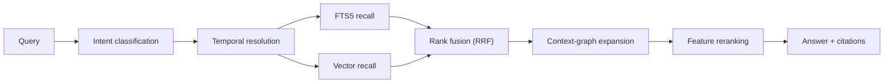

# REWIND — Search & Retrieval

> STEP 7 deliverable (§150). How a question in plain language becomes an answer with evidence.

---

## 1. Pipeline



Everything before `AN` is local and deterministic. `AN` is optional: with no LLM configured, Ask returns
ranked, cited results and a deterministic summary instead of prose. The product must be useful in that
mode (PR-2).

---

## 2. Intent classification (§56)

Seven intents, matching §56. Classified by rules first; an LLM classifier is a configurable fallback,
never a requirement.

| Intent       | Example                                 | What it changes                                               |
| ------------ | --------------------------------------- | ------------------------------------------------------------- |
| `resume`     | "resume Friday", "what was I doing?"    | Routes to the Resume engine, not to search                    |
| `temporal`   | "what did I do yesterday afternoon?"    | Time window becomes a hard filter; results grouped by context |
| `retrieval`  | "find the OAuth TikTok docs"            | Recall-heavy; boosts URLs; returns links, not prose           |
| `causal`     | "why did I change this file?"           | Graph expansion dominates; requires evidence or refuses       |
| `summary`    | "what did I work on this week?"         | Aggregates contexts, no per-event results                     |
| `navigation` | "open the Stripe context"               | Direct lookup by name; no ranking                             |
| `comparison` | "how is this different from last time?" | Two windows retrieved and diffed                              |

**Rule classifier.** Ordered, first match wins:

1. Contains a resume phrase (`resume`, `where was I`, `what was I doing`, `pick up`) → `resume`
2. Starts with `why` → `causal`
3. Contains a time expression **and** an action verb (`did`, `worked`, `was`) → `temporal`
4. Starts with `open`, `go to`, `show me the … context` → `navigation`
5. Contains `find`, `where`, `which page`, `that doc`, `link` → `retrieval`
6. Contains `summar`, `overview`, `this week`, `recap` → `summary`
7. Contains `compare`, `different`, `versus` → `comparison`
8. Default → `retrieval`

Misclassification is cheap: `retrieval` is a safe default that returns evidence, and the UI lets the
user switch mode with one key.

---

## 3. Temporal resolution (§59)

The layer the spec calls "very important", and it is — most queries about memory are time-shaped.

### Grammar

| Expression class    | Examples                                                      | Resolution                                                                                                  |
| ------------------- | ------------------------------------------------------------- | ----------------------------------------------------------------------------------------------------------- |
| Named days          | today, yesterday, Friday, last Friday, Monday                 | Work-day boundaries with the 04:00 local cutoff                                                             |
| Relative ranges     | this week, last week, last 3 days, this month                 | Week starts Monday, configurable                                                                            |
| Parts of day        | this morning, yesterday afternoon, last night                 | morning 05:00–12:00, afternoon 12:00–18:00, evening 18:00–23:00, night 23:00–05:00                          |
| Meal-anchored       | before lunch, after lunch                                     | Lunch inferred from the user's own longest midday idle gap over the last 30 days, defaulting to 12:00–13:00 |
| Event-anchored      | after that meeting, before the deploy                         | Resolved against calendar events (post-MVP) or against a matching event found in the corpus                 |
| Occurrence-anchored | last time I worked on Stripe, the first time I saw this error | Sub-query → resolve to a context or event → take its window                                                 |
| Absolute            | March 12, 2026-03-12, last March                              | Direct                                                                                                      |
| Vague               | recently, a while ago, back then                              | Soft recency boost, never a hard filter                                                                     |

### Rules that prevent wrong answers

- **Store and resolve with `tzOffsetMinutes`** (TR-8). "Friday afternoon" means the user's local Friday
  afternoon _at the time those events happened_, not the query-time timezone. A flight between the work
  and the question must not move the memory.
- **Work-day cutoff at 04:00 local.** A commit at 01:30 belongs to the previous work day. Verified
  against real developer behaviour; configurable.
- **Hard vs. soft.** Explicit expressions are hard filters. Vague ones are ranking boosts. Never filter
  on a guess — an empty result set from a misread "recently" is a worse failure than a mis-ranked list.
- **Ambiguity is surfaced.** "Last Friday" on a Wednesday is unambiguous; on a Saturday it is not. The
  UI shows the resolved window as an editable chip: `Fri 22 Aug, 00:00 → 23:59 ▾`.

Every rule here is unit-tested with a frozen clock across DST transitions and timezone changes (§123).

---

## 4. Recall

### 4.1 Lexical — FTS5 (§37)

One external-content FTS5 table per searchable layer, so ranking can differ by layer:

| Table            | Indexed columns                                                       |
| ---------------- | --------------------------------------------------------------------- |
| `events_fts`     | `searchableText` (title, path, URL, redacted command, commit message) |
| `activities_fts` | `label`, file basenames, command heads, URL hosts                     |
| `contexts_fts`   | `name`, `summary.text`, ticket IDs, branch names                      |

Tokeniser: `unicode61` with `remove_diacritics 2`, plus a custom pre-tokenisation pass that splits
identifiers so `stripe.webhook.ts` matches `webhook`, and `feature/auth-session` matches `auth` and
`session`. Without that pass, code-shaped queries fail badly.

Ranking: `bm25()` with column weights — context name 3.0, summary 2.0, file path 1.5, title 1.0,
URL 1.0.

FTS5 is **prefix-indexed** (`prefix='2 3 4'`) so the search box can respond as the user types.

### 4.2 Semantic — vectors (§38)

`sqlite-vec`, statically linked, 384-dim `bge-small-en-v1.5` (TR-7). Indexed: **activities and
contexts only** — never raw events (TR-6). Query embedding computed locally; k-NN with `k = 50`.

If the extension is unavailable, this stage is skipped, weights renormalise, and the UI shows a
one-time notice that semantic search is off. Search degrades; it never fails.

### 4.3 Fusion

Lexical and vector scores are not comparable, so they are fused by **Reciprocal Rank Fusion** rather
than a weighted sum of raw scores:

```
RRF(d) = Σ_over_retrievers  1 / (k + rank_r(d))        # k = 60
```

RRF is robust to score-scale differences and needs no per-corpus calibration, which matters because this
corpus is one person's and changes shape weekly.

---

## 5. Context-graph expansion

This is what makes REWIND better than a search box over a log.

After fusion, take the top 10 candidates and pull in their neighbours through `ContextLink` edges
(EVENT_MODEL §9):

```
event      → its activity → its context
context    → linked files, URLs, commits, commands, errors, decisions
file        → other contexts that modified it
commit     → the context that produced it → the research that preceded it
ticket ID  → every context referencing it
```

Expansion is depth-1 by default, depth-2 for `causal` intent (that is exactly the "why does this exist?"
chain: file → commit → context → researched URLs → decision). Expanded items enter reranking with a
0.7 multiplier so they support the answer without displacing direct matches.

---

## 6. Reranking (§58)

```
score = 0.30 × semantic          # cosine, or renormalised away if vectors unavailable
      + 0.25 × lexical           # normalised bm25
      + 0.15 × recency           # exp(-Δt / τ), τ = 14 days
      + 0.15 × contextAffinity   # same context / project as the current or referenced one
      + 0.10 × sourceImportance  # EVENT_MODEL §2.2 importance, normalised
      + 0.05 × graphProximity    # 1.0 direct, 0.7 depth-1, 0.5 depth-2
```

Then modifiers:

- `× 1.25` if inside a hard temporal filter's core window (vs. its fuzzy edges).
- `× 1.15` if the item is pinned or bookmarked (§77).
- `× 0.6` if `privacyLevel: sensitive` and the query does not lexically match it (do not surface
  sensitive material on a semantic hunch).
- `× 0.0` if `privacyLevel: private` and the query is not an exact-match lookup.

Deduplication: results collapse to one row per `(contextId, targetKey)`, keeping the highest-scoring
member and showing occurrence count — otherwise a documentation page visited 20 times floods the list.

---

## 7. Answer synthesis

### 7.1 Deterministic mode (default — no LLM configured)

The answer is a **structured result**, not prose:

```
Stripe invoice documentation
  stripe.com/docs/api/invoices
  Read 4 times · 12–14 March · 22 min total
  Context: Stripe renewal bug
  → open  ·  → go to that moment
```

For `temporal` and `summary` intents, the deterministic answer is a rollup by context with durations,
files, commands and commits — which is precisely the §71 daily summary. This mode covers the majority of
real queries, and it is instant and free.

### 7.2 LLM mode (opt-in)

Only after the sanitisation pipeline and disclosure (PRIVACY §8). Input is the reranked top-N as
_structured facts_, never raw events. Output is schema-validated (§132):

```json
{
  "answer": "…",
  "confidence": "high" | "medium" | "low",
  "citations": [{ "evidenceId": "…", "label": "…", "timestamp": 0 }],
  "insufficientEvidence": false
}
```

**Rules the prompt enforces and the validator checks:**

- Every factual claim carries a citation. A response whose `citations` array is empty while
  `insufficientEvidence` is `false` is **rejected** and the deterministic answer is shown instead.
- Citations must reference evidence IDs that were actually in the input. Fabricated IDs invalidate the
  whole response.
- The model is instructed to set `insufficientEvidence: true` rather than infer (§79).

### 7.3 Refusal (§79)

When the top result's score is below `MIN_ANSWER_SCORE` (0.35), or fewer than two independent sources
support a causal claim, REWIND says so:

```
I couldn't find enough evidence to answer that.

Closest matches:
  · Stripe webhook work — 12 March
  · pnpm test stripe (failed) — 14 March

Try: a different time range, or a file or command you remember.
```

Never invented reasons, decisions, tasks or people. This is a hard product rule, and it is tested with
adversarial queries about work that never happened.

---

## 8. Citations (§54, §134)

Every answer carries its sources, each clickable to the exact timeline moment:

```
14:22  Git commit a72c91          "handle invoice.created before subscription.updated"
14:04  stripe.com/docs/api/invoices
13:58  DNM-3921 — Stripe renewal
14:33  Claude Code session · myapp
```

Citations resolve through `ContextLink`, which survives raw-event compaction (TR-5). An answer about
work from a year ago still cites a real commit SHA and a real URL, even after the underlying raw events
have been compacted away.

---

## 9. Performance

| Stage                                 | Budget (p95)             |
| ------------------------------------- | ------------------------ |
| Intent + temporal resolution          | < 5 ms                   |
| FTS5 recall                           | < 30 ms                  |
| Query embedding (local)               | < 60 ms                  |
| Vector k-NN                           | < 40 ms                  |
| Fusion + expansion + rerank           | < 50 ms                  |
| **Total, deterministic mode**         | **< 200 ms**             |
| Search-as-you-type (prefix, FTS only) | < 50 ms                  |
| With LLM answer                       | provider-bound, streamed |

Achieved by: keeping vectors at the activity/context layer (thousands of rows, not millions), prefix
indexes for incremental search, a hot LRU cache of recent query results, and doing all ranking in Rust
against an already-warm SQLite page cache.

---

## 10. Evaluation (§127)

A frozen dataset of realistic questions with known-correct targets, run headlessly by
`rewind-cli eval search`:

```
fixtures/search-eval/queries.json
  { "q": "where was that OAuth documentation",   "expect": ["url:developers.tiktok.com/doc/oauth"] }
  { "q": "what command failed on Friday",        "expect": ["cmd:pnpm test stripe"] }
  { "q": "which files did I modify for the auth bug", "expect": ["file:src/auth.ts", "file:src/session.ts"] }
  { "q": "why does firstPaymentAt exist",        "expect": ["commit:a72c91", "url:stripe.com/docs/api/invoices"] }
  { "q": "what did I leave unfinished yesterday","expect": ["context:stripe-renewal"] }
```

Reported: top-1 accuracy, top-3 accuracy, MRR, and per-intent breakdown. Targets at MVP: top-1 > 50 %,
top-3 > 70 %.

The evaluation runs on every change to ranking weights. A weight change that helps one query class and
hurts another is not shipped on intuition — the numbers decide.

---

## 11. What search deliberately does not do

- No cross-user or cross-machine search — there is nothing to federate (§152).
- No natural-language database querying ("show me all events where…"). The intents in §2 cover the real
  questions; a query language is a different product.
- No result caching across a privacy-rule change: editing exclusions invalidates the cache, so a newly
  excluded domain cannot resurface from a stale result set.
